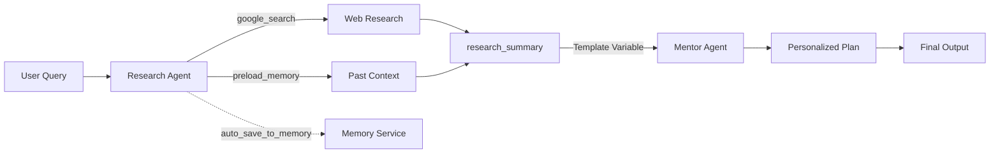

# 🎯 AI Career Advisor Agent

**A production-ready multi-agent system for personalized career transition guidance**

Built with Google's Agent Development Kit (ADK) as part of the AI Agents intensive program.

- **Course hub:** https://www.kaggle.com/competitions/agents-intensive-capstone-project
- **Status:** ✅ Working implementation with research, planning, and memory capabilities

---

## 📋 Table of Contents

1. [The Problem](#-the-problem)
2. [The Solution](#-the-solution)
3. [Value Proposition](#-value-proposition)
4. [Architecture](#-architecture)
5. [Key Concepts & Implementation](#-key-concepts--implementation)
6. [Setup Instructions](#-setup-instructions)
7. [Usage](#-usage)
8. [Project Structure](#-project-structure)
9. [Technical Details](#-technical-details)
10. [Future Enhancements](#-future-enhancements)

---

## 🎯 The Problem

**Career transitions are complex, time-consuming, and overwhelming.**

When professionals want to pivot careers, they face:
- **Information overload**: Hundreds of blog posts, courses, and conflicting advice
- **Analysis paralysis**: Too many options without clear prioritization
- **Generic guidance**: One-size-fits-all advice that ignores individual backgrounds
- **Scattered research**: No single source for skills, resources, timelines, and success stories
- **Lost context**: Restarting research from scratch in every browsing session

**The result?** People spend weeks researching instead of learning, get discouraged by the complexity, or make uninformed decisions about their career path.

---

## 💡 The Solution

**AI Career Advisor** is an intelligent multi-agent system that automates career transition research and creates personalized action plans.

### What It Does

1. **🔍 Researches** target career paths using Google Search
   - Required skills and typical progressions
   - Learning resources (courses, certifications, books)
   - Market outlook (demand, salary ranges, growth trends)
   - Success stories from similar transitions

2. **📝 Creates** personalized 3-phase transition roadmaps
   - Phase 1 (Months 1-3): Foundation building with quick wins
   - Phase 2 (Months 4-6): Portfolio projects and networking
   - Phase 3 (Months 6-9): Job search preparation
   - Tailored to the user's experience, time commitment, and background

3. **🧠 Remembers** context across sessions
   - Long-term memory persists career goals and preferences
   - Session memory maintains conversation continuity
   - No need to repeat information in follow-up conversations

---

## 💎 Value Proposition

### For Career Transitioners
- ⏰ **Save 20+ hours** of scattered research time
- 🎯 **Get specific, actionable advice** tailored to your background
- 📊 **Make data-driven decisions** with market insights and salary data
- 🗺️ **Follow a clear roadmap** with measurable monthly milestones
- 💪 **Build confidence** with success stories and realistic timelines

### For Career Coaches
- 🤖 **Automate initial research** to focus on high-value guidance
- 📋 **Standardize intake process** with consistent information gathering
- 🔄 **Scale your impact** without proportional time investment
- 📈 **Track client progress** with persistent memory and session logs

---

## 🏗️ Architecture

### System Overview

```
┌─────────────────────────────────────────────────────────────┐
│                     User Query                               │
│  "I'm a Product Manager wanting to transition to Data       │
│   Science with 10 hours/week available"                     │
└─────────────────┬───────────────────────────────────────────┘
                  │
                  ▼
┌─────────────────────────────────────────────────────────────┐
│              SEQUENTIAL AGENT PIPELINE                       │
│                                                              │
│  ┌────────────────────────┐    ┌─────────────────────────┐ │
│  │   Research Agent       │───▶│    Mentor Agent         │ │
│  │                        │    │                         │ │
│  │ Tools:                 │    │ Input:                  │ │
│  │ • google_search        │    │ • {research_summary}    │ │
│  │ • preload_memory       │    │                         │ │
│  │                        │    │ Output:                 │ │
│  │ Output:                │    │ • 3-phase action plan   │ │
│  │ • Skills required      │    │ • Monthly milestones    │ │
│  │ • Learning resources   │    │ • Personalized advice   │ │
│  │ • Market outlook       │    │                         │ │
│  │ • Success stories      │    │                         │ │
│  └────────────────────────┘    └─────────────────────────┘ │
│                                                              │
└──────────────────────┬───────────────────────────────────────┘
                       │
                       ▼
┌─────────────────────────────────────────────────────────────┐
│                  Memory Services                             │
│                                                              │
│  ┌──────────────────────┐    ┌──────────────────────────┐  │
│  │  Session Memory      │    │   Long-term Memory       │  │
│  │  (Short-term)        │    │   (Persistent)           │  │
│  │                      │    │                          │  │
│  │ • Conversation       │    │ • Career goals           │  │
│  │   history            │    │ • User preferences       │  │
│  │ • Current context    │    │ • Past research          │  │
│  │                      │    │ • Auto-saved via         │  │
│  │ Scope: Single        │    │   callbacks              │  │
│  │        session       │    │                          │  │
│  └──────────────────────┘    └──────────────────────────┘  │
└─────────────────────────────────────────────────────────────┘
```

### Agent Flow



### Key Design Decisions

1. **Sequential over Parallel**: Research must complete before mentoring to ensure advice is grounded in current data
2. **Memory Callbacks**: Automatic saving eliminates manual memory management
3. **Structured Output Keys**: Template variables (`{research_summary}`) enable clean data flow between agents
4. **Tool Separation**: Research agent has search tools; mentor agent focuses purely on synthesis
5. **Gemini 2.5 Flash Lite**: Fast, cost-effective model suitable for production at scale

## 🧠 Key Concepts & Implementation

This project demonstrates **5+ core concepts** from the AI Agents intensive course:

### 1. Sequential Agent Architecture (Day 1)

**Concept**: Orchestrating multiple specialized agents in a pipeline where each agent's output becomes the next agent's input.

**Implementation**:
```python
root_agent = SequentialAgent(
    name="CareerPathPipeline",
    sub_agents=[research_agent, mentor_agent],
)
```

**Why It Matters**: Sequential orchestration ensures the mentor agent receives complete research before creating advice. This prevents hallucinations and grounds recommendations in real data.

**Code Location**: `ai-agent.ipynb` (Section 3)

---

### 2. Tool Integration (Day 2)

**Concept**: Equipping agents with external capabilities through built-in and custom tools.

**Implementation**:
```python
research_agent = LlmAgent(
    name="research_agent",
    tools=[google_search, preload_memory],
    # ...
)
```

**Tools Used**:
- **`google_search`**: Real-time web research for market data
- **`preload_memory`**: Retrieves past conversations for context

**Why It Matters**: Tools transform LLMs from text generators into action-taking systems that can gather real-world information and maintain context.

**Code Location**: `ai-agent.ipynb` (Section 2)

---

### 3. Memory Services (Day 3)

**Concept**: Dual-layer memory system for both short-term conversation and long-term knowledge retention.

**Implementation**:
```python
session_service = InMemorySessionService()  # Short-term
memory_service = InMemoryMemoryService()    # Long-term

runner = Runner(
    agent=root_agent,
    session_service=session_service,
    memory_service=memory_service,
)
```

**Memory Flow**:
- **Session Memory**: Automatically tracks conversation within a session
- **Long-term Memory**: Persisted via `auto_save_to_memory` callback
- **Retrieval**: `preload_memory` tool accesses saved context across sessions

**Why It Matters**: Users don't need to repeat their career goals in every conversation. The agent "remembers" previous discussions and builds on them.

**Code Location**: `ai-agent.ipynb` (Section 3)

---

### 4. Callbacks & Automation (Day 4 Foundation)

**Concept**: Lifecycle hooks that execute automatically during agent operations.

**Implementation**:
```python
async def auto_save_to_memory(callback_context):
    """Automatically save session to memory after each agent turn."""
    session = callback_context._invocation_context.session
    await callback_context._invocation_context.memory_service.add_session_to_memory(session)

research_agent = LlmAgent(
    # ...
    after_agent_callback=auto_save_to_memory,
)
```

**Why It Matters**: Eliminates manual memory management. Every research session is automatically saved for future reference without requiring explicit code in the agent logic.

**Code Location**: `ai-agent.ipynb` (Section 2)

---

### 5. Structured Output & Data Flow

**Concept**: Using output keys and template variables to pass structured data between agents.

**Implementation**:
```python
# Research agent produces structured output
research_agent = LlmAgent(
    output_key="research_summary",
    # ...
)

# Mentor agent consumes it via template variable
mentor_agent = LlmAgent(
    instruction="Based on the research findings: {research_summary}...",
    # ...
)
```

**Why It Matters**: Creates clean separation of concerns. Research agent focuses on gathering data; mentor agent focuses on synthesis. The pipeline handles data flow automatically.

**Code Location**: `ai-agent.ipynb` (Section 2)

---

### 6. Error Handling & Resilience

**Concept**: Graceful degradation and retry logic for production reliability.

**Implementation**:
```python
retry_config = types.HttpRetryOptions(
    attempts=5,
    exp_base=7,
    initial_delay=1,
    http_status_codes=[429, 500, 503, 504],
)

model = Gemini(model="gemini-2.5-flash-lite", retry_options=retry_config)
```

**Why It Matters**: Handles API rate limits, transient failures, and network issues without crashing. Production-grade reliability from day one.

**Code Location**: `ai-agent.ipynb` (Section 1)

---

## 🚀 Setup Instructions

### Prerequisites

- **Python 3.10+** (Python 3.11 recommended)
- **Google API Key** for Gemini models ([get one here](https://aistudio.google.com/apikey))
- **Jupyter** environment (VS Code, JupyterLab, or Google Colab)

### Quick Start (Recommended)

#### 1. Clone the Repository

```bash
git clone https://github.com/YOUR_USERNAME/ai-agent.git
cd ai-agent
```

#### 2. Run Setup

Use the provided Makefile for automated setup:

```bash
make setup
```

This will:
- Install `uv` package manager (if not already installed)
- Install all dependencies via `uv sync`
- Verify your `.env` file exists and is configured

#### 3. Configure API Key

Edit the `.env` file and add your Google API key:

```env
GOOGLE_API_KEY=your_api_key_here
```

**⚠️ Security Note**: Never commit `.env` files to version control. The `.gitignore` is already configured to exclude them.

#### 4. Start Jupyter Lab

```bash
make jupyter
```

### Manual Setup (Alternative)

If you prefer manual installation:

#### 1. Install uv Package Manager

```bash
curl -LsSf https://astral.sh/uv/install.sh | sh
```

#### 2. Install Dependencies

```bash
uv sync
```

Or using `pip`:
```bash
pip install -e .
```

**Dependencies include**:
- `google-genai` - Gemini API client
- `google-adk` - Agent Development Kit
- `python-dotenv` - Environment variable management

#### 3. Configure Environment Variables

Create a `.env` file and add your Google API key as shown above.

#### 4. Open the Notebook

**VS Code**:
```bash
code ai-agent.ipynb
```

**JupyterLab**:
```bash
jupyter lab ai-agent.ipynb
```

**Google Colab**:
1. Upload `ai-agent.ipynb`
2. Install dependencies in a cell: `!pip install google-genai google-adk python-dotenv`
3. Configure secrets using Colab's secrets manager

#### 5. Run the Cells

Execute cells in order:
1. **Setup & Configuration** - Imports and API key validation
2. **Agent Definitions** - Creates research and mentor agents
3. **Pipeline Assembly** - Builds the sequential pipeline
4. **Testing** - Runs a sample career transition query

---

## 📖 Usage

### Basic Usage

```python
# Run the career advisor with a sample query
await run_session(
    runner,
    "I am a Product Manager with 5 years of experience. I want to transition to data science and can dedicate 10 hours per week.",
    session_name="career-transition-demo",
    last_agent_only=True,  # Only show final mentor output
)
```

### Multi-Turn Conversations

```python
# First conversation
await run_session(
    runner,
    "I'm a teacher with 8 years of experience wanting to become a UX designer",
    session_name="teacher-to-ux"
)

# Follow-up in the same session
await run_session(
    runner,
    "I can dedicate 15 hours per week and have some basic design skills",
    session_name="teacher-to-ux"
)
```

### Viewing All Agent Outputs

```python
# Show both research and mentor outputs
await run_session(
    runner,
    "Your query here",
    session_name="my-session",
    last_agent_only=False  # Show all agents
)
```

### Custom Queries

Your query should include:
- ✅ **Current role** (e.g., "Product Manager")
- ✅ **Years of experience** (e.g., "5 years")
- ✅ **Target role** (e.g., "Data Scientist")
- ✅ **Time commitment** (e.g., "10 hours per week")

**Example queries**:
```python
# Software Engineer → AI/ML Engineer
"I'm a software engineer with 7 years in backend development. I want to transition to AI/ML engineering and can study 12 hours weekly."

# Marketing Manager → Data Analyst
"I'm a marketing manager with 6 years of experience. I want to become a data analyst and have 8 hours per week available."

# Journalist → Technical Writer
"I'm a journalist with 10 years of experience. I want to transition to technical writing for tech companies with 20 hours per week."
```

---

## 📁 Project Structure

```
ai-agent/
├── ai-agent.ipynb           # Main career advisor notebook (includes all agent logic)
├── pyproject.toml           # Project dependencies and metadata
├── uv.lock                  # Locked dependency versions
├── .env                     # API keys (not in git)
├── .gitignore              # Git exclusions
├── README.md               # This file
├── Makefile                # Environment setup commands
└── labs/                   # Course lab notebooks
    ├── day1/               # Agent architectures
    ├── day2/               # Tool integration
    ├── day3/               # Sessions & memory
    ├── day4/               # Observability & evaluation
    └── day5/               # Agent2Agent & deployment
```

---

## 🔧 Technical Details

### Model Selection

**Gemini 2.5 Flash Lite** was chosen for:
- ⚡ **Fast response times** (< 2 seconds average)
- 💰 **Cost efficiency** for production scaling
- 🎯 **Strong performance** on structured output tasks
- 🔄 **Reliable retry handling** for API stability

### Prompt Engineering

Both agents use carefully structured prompts:

**Research Agent**:
- Clear task breakdown (skills, resources, market outlook)
- Specific output format requirements
- Context prioritization (check memory first, then search)

**Mentor Agent**:
- Receives structured input via `{research_summary}`
- 3-phase framework for consistency
- Emphasis on personalization and background leveraging

### Memory Strategy

**When to use each memory type**:

| Scenario | Session Memory | Long-term Memory |
|----------|---------------|------------------|
| Same conversation, multiple messages | ✅ Automatic | ❌ Not needed |
| Different sessions, same user | ❌ Lost | ✅ Via preload_memory |
| Fresh start, no history | ✅ New session | ❌ Empty |

**Best practices implemented**:
- Auto-save after research completion (high-value content)
- Don't save mentor output (derived from research)
- Use session names for logical grouping

### Session Management

The `run_session` helper function (defined in `ai-agent.ipynb`):
- Creates or retrieves sessions by name
- Handles query streaming
- Filters agent outputs based on `last_agent_only` flag
- Provides formatted output with agent names

---

## 🔮 Future Enhancements

### Short-term Improvements
- [ ] **Resume Upload Tool**: Parse user's resume for automatic background extraction
- [ ] **Salary Calculator**: Estimate earning potential in target role based on location
- [ ] **Job Board Integration**: Search LinkedIn/Indeed for actual openings
- [ ] **Progress Tracking**: Monthly check-in agent to measure milestone completion

### Advanced Features
- [ ] **LoopAgent for Refinement**: Iteratively improve action plans based on user feedback
- [ ] **Parallel Research**: Multiple research agents for faster data gathering
- [ ] **Observability Dashboard**: LoggingPlugin + traces for production monitoring
- [ ] **Evaluation Suite**: Automated testing with example career transitions
- [ ] **Vertex AI Deployment**: Production deployment with Agent Engine

### Platform Expansion
- [ ] **Web UI**: Streamlit or Gradio interface for non-technical users
- [ ] **Slack Bot**: Integration for company career development programs
- [ ] **API Endpoint**: REST API for third-party integrations
- [ ] **Mobile App**: iOS/Android companion app

---

## 📚 Course Labs & Learning Journey

The `labs/` directory contains exercises from the 5-day AI Agents intensive:

| Day | Focus | Key Learnings Applied |
|-----|-------|----------------------|
| **Day 1** | Agent Architectures | Sequential pipeline design |
| **Day 2** | Tool Integration | google_search + preload_memory |
| **Day 3** | Sessions & Memory | Dual-layer memory system |
| **Day 4** | Observability | Retry config, error handling |
| **Day 5** | Deployment | Production-ready patterns |

Each lab built incrementally toward this capstone project.

---

## 🤝 Contributing

This is a capstone project for the AI Agents intensive. While it's primarily for educational purposes, suggestions and feedback are welcome!

To report issues or suggest improvements:
1. Open an issue describing the problem or enhancement
2. Include relevant code snippets or error messages
3. Tag with appropriate labels (bug, enhancement, documentation)

---

## 📜 License

This project is licensed under the MIT License - see the LICENSE file for details.

---

## 🙏 Acknowledgments

- **Google & Kaggle** for the AI Agents intensive program
- **ADK Team** for the powerful Agent Development Kit
- **Course Instructors** for comprehensive labs and guidance
- **Gemini API** for enabling fast, cost-effective agent operations

---

## 📧 Contact

For questions about this implementation:
- Open an issue in this repository
- Check the [ADK documentation](https://google.github.io/adk-docs/)
- Review the course materials at [Kaggle](https://www.kaggle.com/competitions/agents-intensive-capstone-project)

---

**Built with ❤️ using Google's Agent Development Kit**
